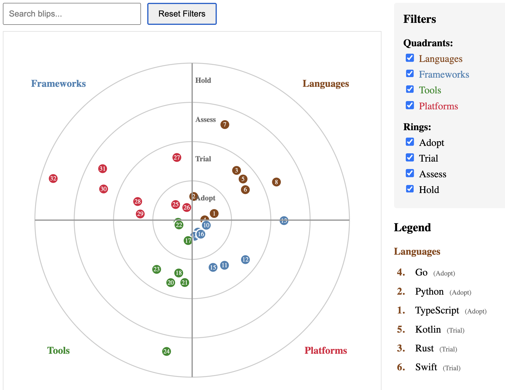

# Radar



Radar visualization based on the concepts of Thoughtworks Technology Radar.

Features:

- ✅ Numbered blips - easy reference
- ✅ Four quadrants - divided by horizontal and vertical lines
- ✅ Concentric rings - representing adoption stages
- ✅ Random positioning - blips placed randomly within their ring/quadrant
- ✅ Color-coded - each quadrant has its own color
- ✅ Interactive tooltips - hover to see blip details
- ✅ Configurable - customize size, labels, colors, rings

Features for interactions:

- ✨ Animated entrance - Blips fade in and grow smoothly
- 🔍 Search functionality - Filter by name in real-time
- 🎛️ Quadrant filters - Toggle quadrants on/off
- 🎚️ Ring filters - Toggle rings on/off
- 📋 Interactive legend - Grouped by quadrant with ring labels
- 🔗 Bidirectional highlighting - Hover radar→legend or legend→radar
- 🔄 Smooth transitions - Animated filtering and updates
- 🎨 Professional styling - Clean, modern UI
- 🖱️ Click events - Add custom actions on blip/legend clicks

TypeScript improvements:

- ✅ Strong typing - All interfaces properly defined
- ✅ Type safety - D3 selections typed correctly
- ✅ Class-based - Encapsulated OOP design
- ✅ Generic constraints - Proper D3 generic types
- ✅ Event typing - MouseEvent, Event types
- ✅ Null safety - Proper optional chaining
- ✅ Method visibility - Public/private methods
- ✅ Configuration - Type-safe config with defaults
- ✅ Destroy method - Cleanup for SPAs

## How to run this

Run development server:

```sh
npm run dev
```

## Project structure

```txt
radar/
├── src/
│   ├── types.ts
│   ├── radar.ts
│   └── main.ts
├── index.html
├── package.json
└── tsconfig.json
```

## How to create this from scratch

Run:

```sh
npm create vite@latest radar -- --template vanilla-ts
cd radar
npm install d3
npm install -D @types/d3
```

Then ask Claude AI to build the whole thing, then debug.
